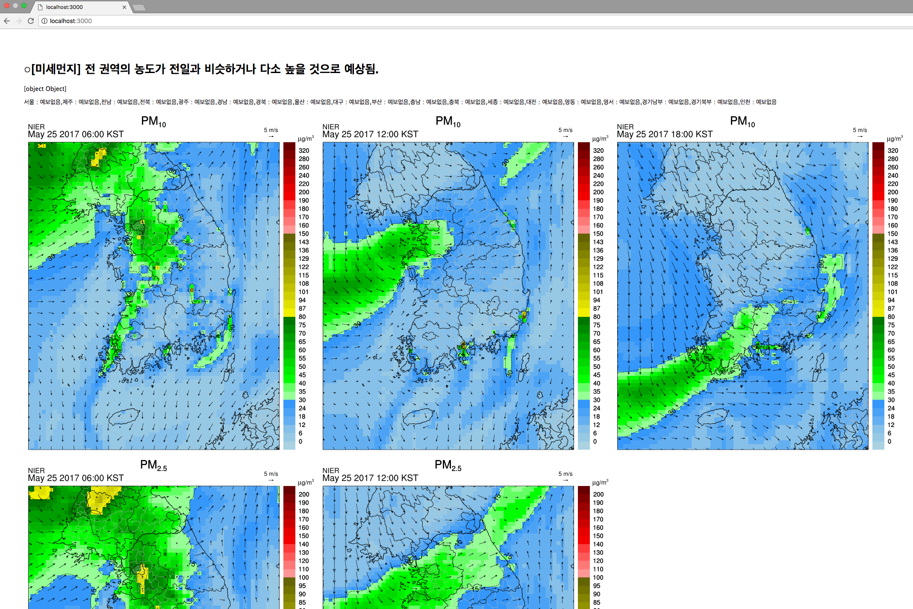

# 공공 API (미세먼지측정) 활용 실습 #

Node.js에서 공공 API를 활용해서 개발하는 방법이란 주제로 발표자료와 테스트 페이지를 만들어 봤습니다.  
기능도 좀 이것저것 추가하고 style도 다듬고 하면 좋았을텐데 개인적인 사정으로 시간관계상 아쉽지만 기본적인 연동 test 수준에서 그쳤네요.

-  [발표 슬라이드](https://www.slideshare.net/inhokwon16/nodejs-api-76200873)
-  [프로젝트](https://github.com/kwoninho/dust-vis)
- 스크린샷
